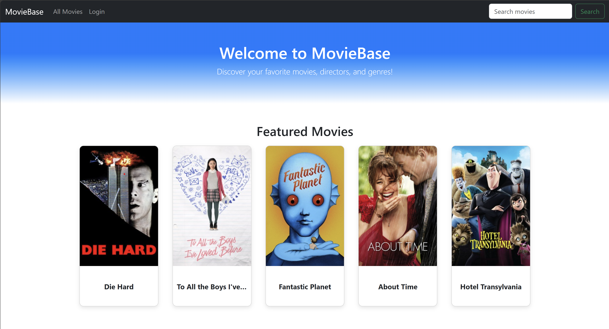
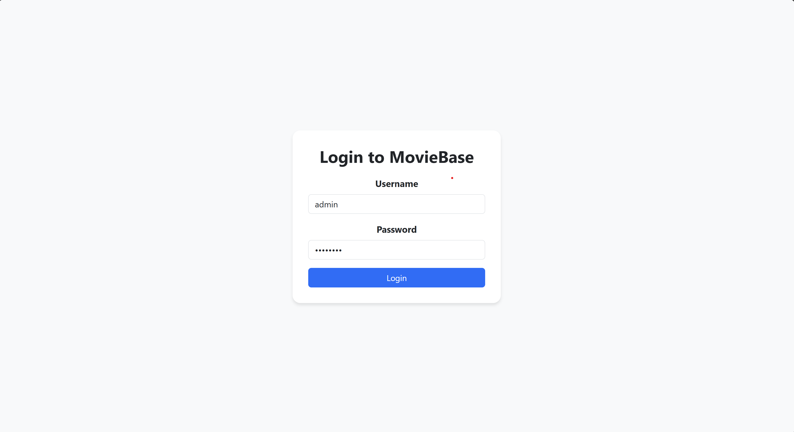
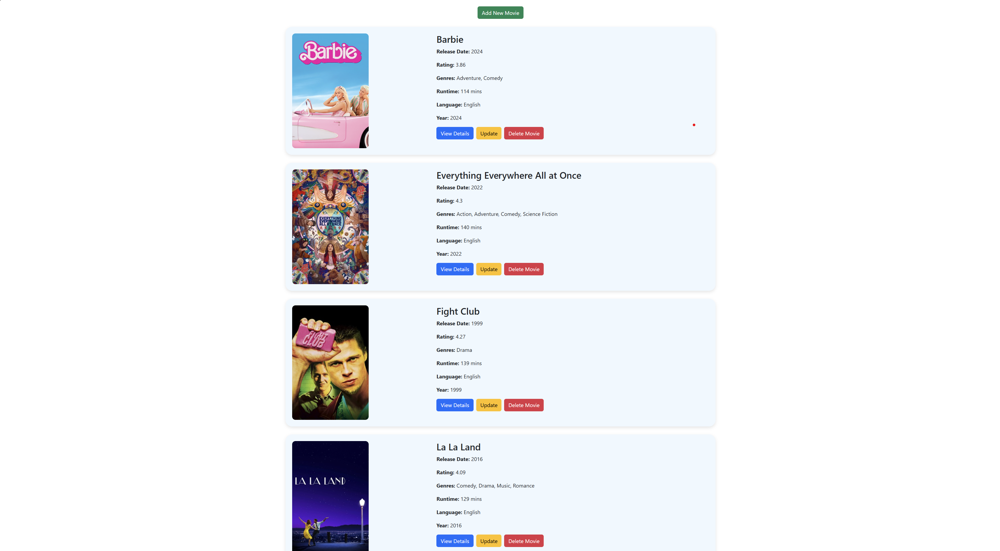
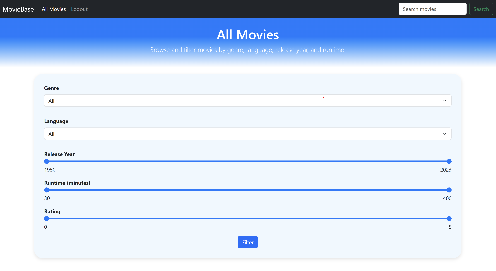
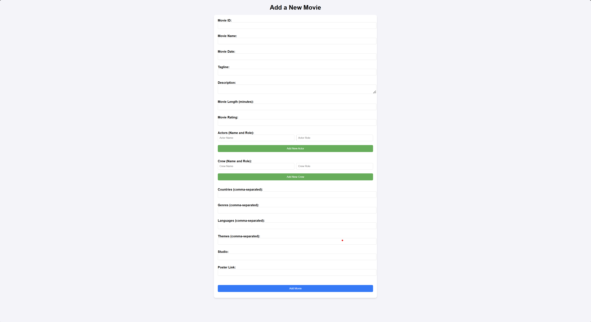
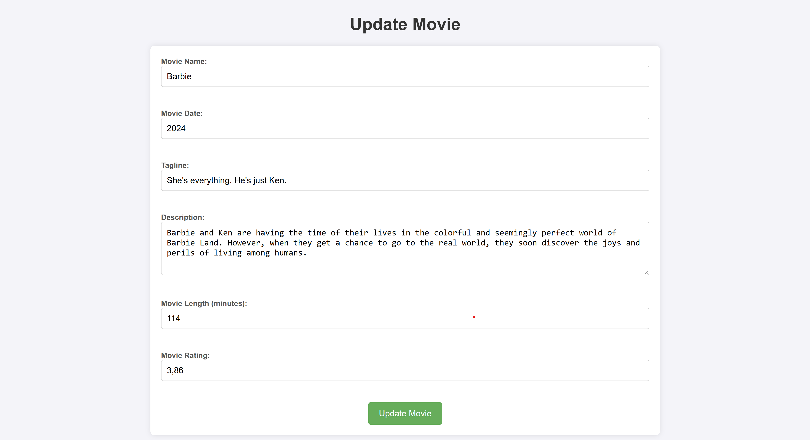
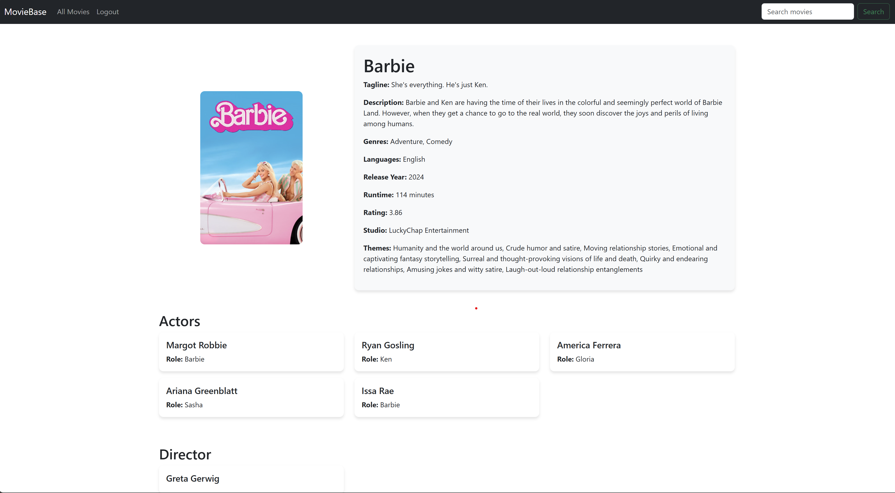

# 🎬 Movie Management System

A **full-stack web application** built with **Flask, MySQL, HTML, CSS, and JavaScript** that allows users to **search, filter, add, edit, and delete movies**.  

This project was developed as a group project for the the **BLG317E - Database Systems course** at Istanbul Technical University.

---

## 🚀 Features

✔ **🔐 Secure Login System** – Users must log in before performing any modifications  
✔ **Search & Filter Movies** – Easily find movies based on title, genre, release year, or rating 
✔ **Add Movies** – Insert new movies into the database (**login required**)  
✔ **Edit & Update Movies** – Modify movie details dynamically (**login required**)  
✔ **Delete Movies** – Remove movies from the database (**login required**)  
✔ **Responsive UI** – Built with plain HTML/CSS/JS for simplicity  
✔ **Secure Backend** – Flask handles authentication & CRUD operations  
✔ **MySQL Database** – Stores all movie data efficiently  

---

## 🖼️ Screenshots

### 🔹 Dashboard Page

### 🔹 Login Page

### 🔹 All Movies Page

### 🔹 Filter

### 🔹 Add Movie Page

### 🔹 Update Movie Page

### 🔹 Movie Details Page

---

##  📊 Database ER Diagram

  

---

## 🛠️ Tech Stack

- **Frontend**: HTML, CSS, JavaScript, Bootstrap
- **Backend**: Flask (Python)  
- **Database**: MySQL  
- **Other**: Session-based authentication

---
